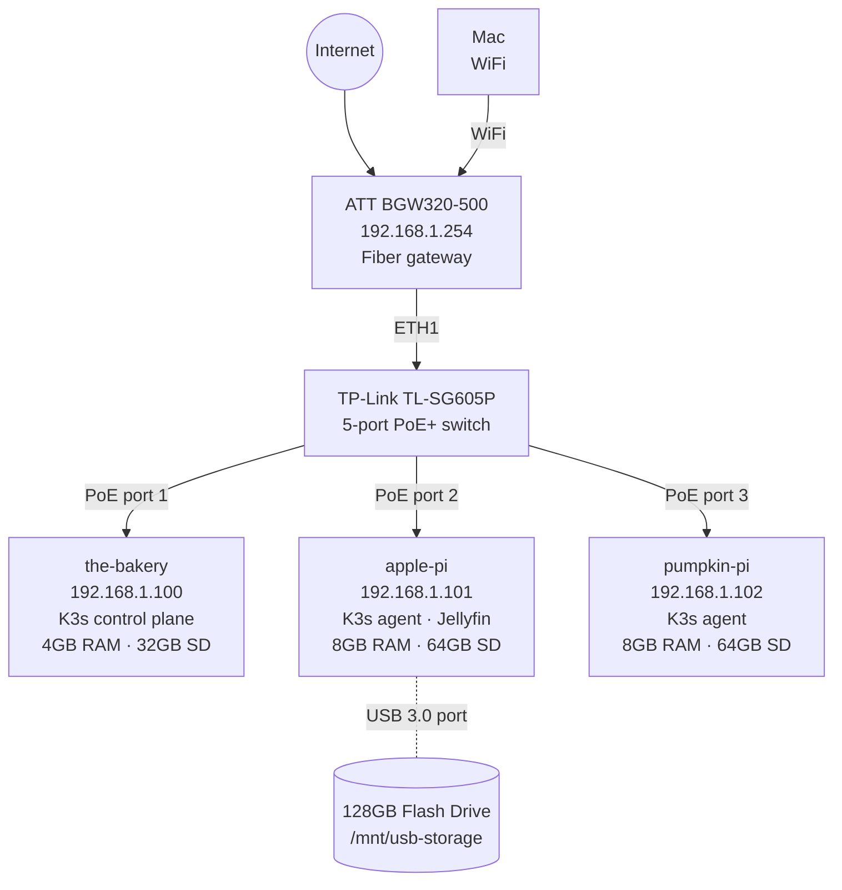

# pi-k3s-homelab

A git-driven Kubernetes homelab running on Raspberry Pi 4s. Cluster provisioning is fully reproducible via cloud-init (first boot) and Ansible (ongoing config). Everything is templated from a single source of truth.

## Hardware

| Node | Hostname | IP | Role | RAM | Storage |
|------|----------|----|------|-----|---------|
| Server | the-bakery | 192.168.1.100 | K3s control plane | 4GB | 32GB SD |
| Agent 1 | apple-pi | 192.168.1.101 | K3s agent, Jellyfin | 8GB | 64GB SD + 128GB USB-C |
| Agent 2 | pumpkin-pi | 192.168.1.102 | K3s agent | 8GB | 64GB SD |

- 3x Raspberry Pi 4 Model B with PoE hats
- TP-Link TL-SG605P 5-port PoE+ switch (ports 1–3 → Pis, port 5 → ATT router ETH1) — **keep the Extend toggle on the back panel OFF** (Extend mode hard-locks ports to 10 Mbps)
- ATT BGW320-500 router (192.168.1.254) — **use ETH1/3/4 for switch uplink, not ETH2**

## Network Topology



## Stack

- **OS**: Ubuntu Server 24.04 LTS (arm64), configured entirely via cloud-init
- **K8s**: K3s with Traefik ingress + local-path-provisioner
- **Workloads**: Jellyfin media server, pinned to apple-pi (USB storage node)
- **File sharing**: Samba on apple-pi; guest access to `/mnt/usb-storage/media` with no password

## Quick Start

### Initial node setup (one-time)

1. Flash Ubuntu Server 24.04 to each SD card with no OS customization
2. Run `make generate` to render cloud-init files from templates
3. Copy cloud-init files to each SD card's `system-boot` partition:
   ```bash
   cp cloud-init/network-config-<node>.yaml /Volumes/system-boot/network-config
   cp cloud-init/meta-data-<node>.yaml /Volumes/system-boot/meta-data
   cp cloud-init/user-data-<node>.yaml /Volumes/system-boot/user-data
   diskutil eject /Volumes/system-boot
   ```
4. Boot the Pis (PoE powers them automatically when plugged in)

### Cluster bring-up

```bash
make generate       # Render all Jinja2 templates
make setup          # Ansible: OS prep, USB mount
make install-k3s    # Ansible: install K3s server then agents
make bootstrap-flux # Bootstrap Flux CD (one-time, requires bw unlocked)
make status         # Check nodes and pods
make flux-status    # Check Flux reconciliation state
```

### SSH access

```bash
make ssh-the-bakery
make ssh-apple-pi
make ssh-pumpkin-pi
```

## Repo Structure

```
ansible/
  group_vars/all.yaml      ← SINGLE SOURCE OF TRUTH — edit here, then make generate
  inventory.yaml           ← generated
  playbooks/
    generate-configs.yaml  ← renders all templates
    base-setup.yaml        ← OS prep, USB mount
    k3s-install.yaml       ← K3s install
cloud-init/
  templates/               ← Jinja2 templates
  *.yaml                   ← generated per-node configs
charts/
  jellyfin/                ← Jellyfin Helm chart
  pihole/                  ← Pi-hole Helm chart
flux/
  apps/                    ← HelmRelease CRDs
  flux-system/             ← Flux bootstrap (do not edit)
Makefile
CLAUDE.md                  ← AI assistant context
SETUP.md                   ← End-to-end human setup guide
```

## Configuration

All hostnames, IPs, storage paths, and node roles live in `ansible/group_vars/all.yaml`.
After any change: `make generate` propagates to all cloud-init files, inventory, k8s manifests, and `.make-vars`.

SSH keys are imported at boot via `ssh_import_id: [gh:kdavis586]` — no keys stored in repo.
Kubeconfig is written to `~/.kube/config-pi-k3s` by `make install-k3s`.

## Storage

A 128GB USB-C flash drive is attached to apple-pi (`/dev/sda1`, exFAT) mounted at `/mnt/usb-storage`.

- Jellyfin config: `/mnt/usb-storage/k8s-volumes` (local-path PVC)
- Jellyfin media: `/mnt/usb-storage/media` (hostPath, directly visible to container)

**Media upload** — Samba share (guest, no password) or rsync:

| Method | How |
|--------|-----|
| macOS (Samba) | Finder → Go → Connect to Server → `smb://apple-pi.local/media` |
| Windows (Samba) | File Explorer → `\\apple-pi\media` |
| rsync | `rsync -av --progress ~/path/to/media/ ubuntu@192.168.1.101:/mnt/usb-storage/media/` |

For bulk transfers, physically swapping the USB drive is faster (exFAT, unmount/remount):
```bash
kubectl --kubeconfig ~/.kube/config-pi-k3s scale deployment jellyfin -n jellyfin --replicas=0
ssh ubuntu@192.168.1.101 "sudo umount /mnt/usb-storage"
# swap drive, copy files, replug
ssh ubuntu@192.168.1.101 "sudo mount -a"
kubectl --kubeconfig ~/.kube/config-pi-k3s scale deployment jellyfin -n jellyfin --replicas=1
```

## Accessing Jellyfin

`http://192.168.1.101` — works on all clients (Apple, Android, Windows).

Use `http://` explicitly — browsers may auto-upgrade bare hostnames to HTTPS.
